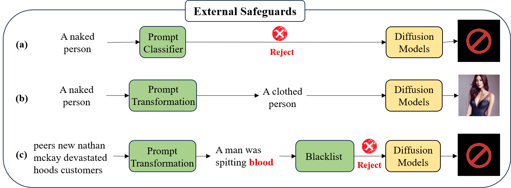

# Awesome-Attacks and Defenses on T2I Diffusion Models

This repository is a curated collection of research papers focused on $\textbf{Adversarial Attacks and Defenses on Text-to-Image Diffusion Models (AD-on-T2IDM)}$.

We will continuously update this collection to track the latest advancements in the field of AD-on-T2IDM.

Welcome to follow and star! If you have any relevant materials or suggestions, please feel free to contact us (zcy@tju.edu.cn) or submit a pull request.

For more detailed information, please refer to our survey paper: [[ARXIV]](https://arxiv.org/abs/2407.15861)， [[Published Version]](https://www.sciencedirect.com/science/article/abs/pii/S1566253524004792)


## :bell:News

- **2024-09-12 Our survey "Adversarial Attacks and Defenses on Text-to-Image Diffusion Models" has been accepted by Information Fusion~(SCI-1, IF14.7).**


## Citation

```latex
@article{zhang2024adversarial,
  title={Adversarial attacks and defenses on text-to-image diffusion models: A survey},
  author={Zhang, Chenyu and Hu, Mingwang and Li, Wenhui and Wang, Lanjun},
  journal={Information Fusion},
  pages={102701},
  year={2024},
  publisher={Elsevier}
}
```


## Content

- [Abstract](#Abstract)
- [Overview_of_AD-on-T2IDM](#Overview)
- [Paper_List](#Paper_List)
- [Resources](#Resources)
  - [Datasets](#Datasets)
  - [Tools](#Tools)


## <a name="Abstract">Abstract</a>

Recently, the text-to-image diffusion model has gained considerable attention from the community due to its exceptional image generation capability. A representative model, Stable Diffusion, amassed more than 10 million users within just two months of its release. This surge in popularity has facilitated studies on the **robustness** and **safety** of the model, leading to the proposal of various adversarial attack methods.  Simultaneously, there has been a marked increase in research focused on defense methods to improve the robustness and safety of these models. In this survey, we provide a comprehensive review of the literature on adversarial attacks and defenses targeting text-to-image diffusion models. We begin with an overview of popular text-to-image diffusion models, followed by an introduction to a taxonomy of adversarial attacks and an in-depth review of existing attack methods. We then present a detailed analysis of current defense methods that improve model robustness and safety. Finally, we discuss ongoing challenges and explore promising future research directions.

## <a name="Overview">Overview of AD-on-T2IDM</a>

### Two key concerns in T2IDM: Robustness and Safety

The **robustness** ensures that the model can generate images with consistent semantics in response to diverse prompts inputted by users in practice.

The **safety** prevents the misuse of the model in creating malicious images, such as sexual, violent, and political images, etc.

### Adversarial attacks

Based on the intent of the adversary, existing attack methods can be divided into two primary categories: untargeted and targeted attacks. 

- For untargeted attacks, consider a scenario with a prompt input by the user~($\textbf{clean prompt}$) and its corresponding output image~($\textbf{clean image}$). The objective of untargeted attacks is to subtly perturb the clean prompt to craft an $\textbf{adversarial prompt}$, further misleading the victim model to generate an $\textbf{adversarial image}$ with semantics different from the clean image. This type of attack is commonly used to uncover the vulnerability in the **robustness** of the victim model. Some untargeted attacks are shown as follows:

  

  

- For targeted attacks, assumes that the victim model has built-in $\textbf{safeguards}$ to filter $\textbf{malicious prompts}$ and resultant $\textbf{malicious images}$. These prompts and images often explicitly contain $\textbf{malicious concepts}$, such as 'nudity', 'violence', and other predefined concepts. The objective of targeted attacks is to obtain an $\textbf{adversarial prompt}$, which can bypass these safeguards while inducing the victim model to generate $\textbf{adversarial images}$ containing malicious concepts. This type of attack is typically designed to reveal the vulnerability in the **safety** of the victim model. Some targeted attacks are shown as follows:

  

### Defenses

Based on the defense goal, existing defense methods can be classified into two categories: 1) **improving model robustness** and 2) **improving model safety**. 

- The goal of robustness is to ensure that generated images have consistent semantics with diverse input prompts in practical applications. Specifically, according to the adversarial attack, the defense methods are asked to mitigate the robustness vulnerabilities in  two types of input prompts: 1) **the prompt with multiple objects and attributes**, and 2) **the grammatically incorrect prompt with the subtle noise**.

- The safety goal is to prevent the generation of malicious images in response to **both malicious and adversarial prompts**. Specifically, malicious prompts explicitly contain malicious concepts, while adversarial prompts cleverly omit these concepts. Moreover, based on the knowledge of the model, existing safety methods can be classified into two categories: **external safeguards** and **internal safeguards**. The external safeguards focus on detecting or correcting the malicious prompt before feeding the prompt into the text-to-image model.  In contrast, internal safeguards aim to ensure that the semantics of output images deviate from those of malicious images by modifying internal parameters and features within the model.  Some examples of external and internal safeguards are shown as follows:

  

  

Notably, although many methods are proposed to improve the model robustness against the prompt with multiple objects and attributes, this collection omits related papers on this part since there has been related surveys, such as controllable image generation [[PDF]](https://arxiv.org/pdf/2403.04279), the development and advancement of image generation capabilities [[PDF-1]](https://arxiv.org/pdf/2209.02646), [[PDF-2]](https://arxiv.org/pdf/2209.00796), [[PDF-3]](https://arxiv.org/pdf/2401.11631). Moreover, for grammatically incorrect prompts with subtle noise, mature solutions are still lacking. Therefore, this collection mainly focuses on the defense methods for improving model safety.

## :grinning:<a name="Paper_List">Paper List</a>

- [Adversarial Attacks](#Adversarial-Attacks)
  - [Untargeted Attacks](#Untargeted-Attacks)
    - [White-Box Attacks](#Untargeted-White-Box-Attacks)
    - [Black-Box Attacks](#Untargeted-Black-Box-Attacks)
  - [Targeted Attacks](#Targeted-Attacks)
    - [White-Box Attacks](#Targeted-White-Box-Attacks)
    - [Black-Box Attacks](#Targeted-Black-Box-Attacks)
- [Defenses for Improving Safety](#Defenses-for-Improving-Safety)
  - [External Safeguards](#External-Safeguards)
    - [Prompt Classifier](#Prompt-Classifier)
    - [Prompt Transformation](#Prompt-Transformation)
  - [Internal Safeguards](#Internal-Safeguards)
    - [Model Editing](#Model-Editing)
    - [Inference Guidance](#Inference-Guidance)

### :imp:<a name="Adversarial-Attacks">Adversarial Attacks</a>

#### :collision:<a name="Untargeted-Attacks">Untargeted Attacks</a>

##### :pouting_cat:<a name="Untargeted-White-Box-Attacks">White-Box Attacks</a>

**Stable diffusion is unstable** 

*Chengbin Du, Yanxi Li, Zhongwei Qiu, Chang Xu*

NeurIPS 2024. [[PDF]](https://proceedings.neurips.cc/paper_files/paper/2023/file/b733cdd80ed2ae7e3156d8c33108c5d5-Paper-Conference.pdf)  [[CODE](https://github.com/duchengbin8/Stable_Diffusion_is_Unstable)]


**A pilot study of query-free adversarial attack against stable diffusion**

*Haomin Zhuang, Yihua Zhang*

CVPRW 2023. [[PDF](https://openaccess.thecvf.com/content/CVPR2023W/AML/papers/Zhuang_A_Pilot_Study_of_Query-Free_Adversarial_Attack_Against_Stable_Diffusion_CVPRW_2023_paper.pdf)] [[CODE](https://github.com/OPTML-Group/QF-Attack)]


##### :see_no_evil:<a name="Untargeted-Black-Box-Attacks">Black-Box Attacks</a>

**Evaluating the Robustness of Text-to-image Diffusion Models against Real-world Attacks**

*Hongcheng Gao , Hao Zhang , Yinpeng Dong, Zhijie Deng*

arxiv 2023. [[PDF](https://arxiv.org/pdf/2306.13103)]


#### :anger:<a name="Targeted-Attacks">Targeted Attacks</a>

##### :cyclone:<a name="Targeted-White-Box-Attacks">White-Box Attacks</a>

**Red-Teaming the Stable Diffusion Safety Filter**

*Javier Rando, Daniel Paleka, David Lindner, Lennart Heim, Florian Tramèr*

NeurIPS 2022, WorkShop. [[PDF](https://arxiv.org/pdf/2210.04610)]


**Unsafe Diffusion: On the Generation of Unsafe Images and Hateful Memes From Text-To-Image Models**

*Yiting Qu, Xinyue Shen, Xinlei He, Michael Backes, Savvas Zannettou, Yang Zhang*

Proceedings of the 2023 ACM SIGSAC Conference on Computer and Communications Security. [[PDF]](https://arxiv.org/pdf/2305.13873) [[CODE]](https://github.com/YitingQu/unsafe-diffusion)


**Ring-A-Bell! How Reliable are Concept Removal Methods for Diffusion Models?**

*Tsai, Yu-Lin and Hsu, Chia-Yi and Xie, Chulin and Lin, Chih-Hsun and Chen, Jia-You and Li, Bo and Chen, Pin-Yu and Yu, Chia-Mu and Huang, Chun-Ying*

ICLR 2024. [[PDF](https://arxiv.org/pdf/2310.10012)]


**Riatig: Reliable and imperceptible adversarial text-to-image generation with natural prompts**

*Han Liu, Yuhao Wu, Shixuan Zhai, Bo Yuan, Ning Zhang*

CVPR 2023. [[PDF](https://openaccess.thecvf.com/content/CVPR2023/papers/Liu_RIATIG_Reliable_and_Imperceptible_Adversarial_Text-to-Image_Generation_With_Natural_Prompts_CVPR_2023_paper.pdf)] [[CODE](https://github.com/WUSTL-CSPL/RIATIG)]


**Mma-diffusion: Multimodal attack on diffusion models**

*Yang, Yijun and Gao, Ruiyuan and Wang, Xiaosen and Ho, Tsung-Yi and Xu, Nan and Xu, Qiang*

CVPR 2024. [[PDF](https://openaccess.thecvf.com/content/CVPR2024/papers/Yang_MMA-Diffusion_MultiModal_Attack_on_Diffusion_Models_CVPR_2024_paper.pdf)] [[CODE](https://github.com/cure-lab/MMA-Diffusion)]


**Asymmetric Bias in Text-to-Image Generation with Adversarial Attacks**

*Haz Sameen Shahgir, Xianghao Kong, Greg Ver Steeg, Yue Dong*

arxiv 2023. [[PDF](https://arxiv.org/pdf/2312.14440)] [[CODE](https://github.com/Patchwork53/AsymmetricAttack)]


**Revealing vulnerabilities in stable diffusion via targeted attacks**

*Chenyu Zhang, Lanjun Wang, Anan Liu*

arxiv 2024. [[PDF](https://arxiv.org/abs/2401.08725)] [[CODE](https://github.com/datar001/Revealing-Vulnerabilities-in-Stable-Diffusion-via-Targeted-Attacks)]


**To generate or not? safety-driven unlearned diffusion models are still easy to generate unsafe images... for now**

*Zhang, Yimeng and Jia, Jinghan and Chen, Xin and Chen, Aochuan and Zhang, Yihua and Liu, Jiancheng and Ding, Ke and Liu, Sijia*

ECCV 2024. [[PDF](https://arxiv.org/pdf/2310.11868)] [[CODE](https://github.com/OPTML-Group/Diffusion-MU-Attack)]


**Prompting4debugging: Red-teaming text-to-image diffusion models by finding problematic prompts**

*Chin, Zhi-Yi and Jiang, Chieh-Ming and Huang, Ching-Chun and Chen, Pin-Yu and Chiu, Wei-Chen*

ICML 2024. [[PDF](https://arxiv.org/pdf/2309.06135)] [[CODE](https://github.com/joycenerd/P4D)]


**ADVI2I: ADVERSARIAL IMAGE ATTACK ON IMAGE-TO-IMAGE DIFFUSION MODELS**

Yaopei Zeng, Yuanpu Cao, Bochuan Cao, Yurui Chang, Jinghui Chen, Lu Lin

arxiv 2024. [[PDF](https://arxiv.org/abs/2410.21471)] [[CODE](https://github.com/Spinozaaa/AdvI2I)]


**Jailbreaking Prompt Attack: A Controllable Adversarial Attack against Diffusion Models**

*Jiachen Ma, Anda Cao, Zhiqing Xiao, Jie Zhang, Chao Ye, Junbo Zhao*

arxiv 2024. [[PDF](https://arxiv.org/pdf/2404.02928)]


**Adversarial Attacks on Parts of Speech: An Empirical Study in Text-to-Image Generation**

G M Shahariar, Jia Chen, Jiachen Li, Yue Dong

arxiv 2024. [[PDF](https://arxiv.org/abs/2409.15381)]


##### :snake:<a name="Targeted-Black-Box-Attacks">Black-Box Attacks</a>

**SneakyPrompt: Evaluating Robustness of Text-to-image Generative Models' Safety Filters**

*Yuchen Yang, Bo Hui, Haolin Yuan, Neil Gong, Yinzhi Cao*

Proceedings of the IEEE Symposium on Security and Privacy 2024. [[PDF](https://arxiv.org/pdf/2305.12082)] [[CODE](https://github.com/Yuchen413/text2image_safety)]


**ART: Automatic Red-teaming for Text-to-Image Models to Protect Benign Users**

Guanlin Li, Kangjie Chen, Shudong Zhang, Jie Zhang, Tianwei Zhang

NeurIPS 2024. [[PDF](https://arxiv.org/abs/2405.19360)] [[CODE](https://github.com/GuanlinLee/ART)]


**FLIRT: Feedback Loop In-context Red Teaming**

*Ninareh Mehrabi, Palash Goyal, Christophe Dupuy, Qian Hu, Shalini Ghosh, Richard Zemel, Kai-Wei Chang, Aram Galstyan, Rahul Gupta*

EMNLP 2024. [[PDF](https://arxiv.org/pdf/2308.04265)]


**Jailbreaking Text-to-Image Models with LLM-Based Agents**

Yingkai Dong, Zheng Li, Xiangtao Meng, Ning Yu, Shanqing Guo

arxiv 2024. [[PDF](https://arxiv.org/abs/2408.00523)]


**Automatic Jailbreaking of the Text-to-Image Generative AI Systems**

Minseon Kim, Hyomin Lee, Boqing Gong, Huishuai Zhang, Sung Ju Hwang

arxiv 2024. [[PDF](https://arxiv.org/abs/2405.16567)] [[CODE](https://github.com/Kim-Minseon/APGP)]


**Exploiting cultural biases via homoglyphs in text-to-image synthesis**

*Struppek, Lukas and Hintersdorf, Dom and Friedrich, Felix and Schramowski, Patrick and Kersting, Kristian*

Journal of Artificial Intelligence Research 2023. [[PDF](https://www.jair.org/index.php/jair/article/view/15388)] [[CODE](https://github.com/LukasStruppek/Exploiting-Cultural-Biases-via-Homoglyphs)]


**Divide-and-Conquer Attack: Harnessing the Power of LLM to Bypass Safety Filters of Text-to-Image Models**

*Yimo Deng, Huangxun Chen*

arxiv 2024. [[PDF](https://arxiv.org/pdf/2312.07130)]


**Groot: Adversarial Testing for Generative Text-to-Image Models with Tree-based Semantic Transformation**

Yi Liu, Guowei Yang, Gelei Deng, Feiyue Chen, Yuqi Chen, Ling Shi, Tianwei Zhang, Yang Liu

arxiv 2024. [[PDF](https://arxiv.org/pdf/2402.12100)]


**BSPA: Exploring Black-box Stealthy Prompt Attacks against Image Generators**

Yu Tian, Xiao Yang, Yinpeng Dong, Heming Yang, Hang Su, Jun Zhu

arxiv 2024. [[PDF](https://arxiv.org/pdf/2402.15218)]


**Black Box Adversarial Prompting for Foundation Models**

*Natalie Maus, Patrick Chao, Eric Wong, Jacob Gardner*

arxiv 2023. [[PDF](https://arxiv.org/pdf/2302.04237)] [[CODE](https://github.com/ibrahimyaghi/Black-Box-Adversarial-Prompting-for-Foundation-Models)]


**Adversarial Attacks on Image Generation With Made-Up Words**

*Raphaël Millière*

arxiv 2022. [[PDF](https://arxiv.org/pdf/2208.04135)]


**SurrogatePrompt: Bypassing the Safety Filter of Text-To-Image Models via Substitution**

*Zhongjie Ba, Jieming Zhong, Jiachen Lei, Peng Cheng, Qinglong Wang, Zhan Qin, Zhibo Wang, Kui Ren*

arxiv 2023. [[PDF](https://arxiv.org/pdf/2309.14122)] 


**RT-Attack: Jailbreaking Text-to-Image Models via Random Token**

Sensen Gao, Xiaojun Jia, Yihao Huang, Ranjie Duan, Jindong Gu, Yang Liu, Qing Guo

arxiv 2024. [[PDF](https://arxiv.org/abs/2408.13896)]


**Perception-guided Jailbreak against Text-to-Image Models**

Yihao Huang, Le Liang, Tianlin Li, Xiaojun Jia, Run Wang, Weikai Miao, Geguang Pu, and Yang Liu

arxiv 2024. [[PDF](https://arxiv.org/abs/2408.10848)]


**DiffZOO: A Purely Query-Based Black-Box Attack for red-teaming Text-to-Image Generative Model via Zeroth Order Optimization**

Pucheng Dang, Xing Hu, Dong Li, Rui Zhang, Kaidi Xu, Qi Guo

arxiv 2024. [[PDF](https://arxiv.org/abs/2408.11071)]


### :pill:<a name="Defenses-for-Improving-Safety">Defenses for Improving Safety</a>

#### :surfer:<a name="External-Safeguards">External Safeguards</a>

##### :mountain_bicyclist:<a name="Prompt-Classifier">Prompt Classifier</a>

**Latent Guard: a Safety Framework for Text-to-image Generation**

*Runtao Liu, Ashkan Khakzar, Jindong Gu, Qifeng Chen, Philip Torr, Fabio Pizzati*

ECCV 2024. [[PDF](https://arxiv.org/pdf/2404.08031)] [[CODE](https://github.com/rt219/LatentGuard)]


##### :horse_racing:<a name="Prompt-Transformation">Prompt Transformation</a>

**Universal Prompt Optimizer for Safe Text-to-Image Generation**

*Zongyu Wu, Hongcheng Gao, Yueze Wang, Xiang Zhang, Suhang Wang*

NAACL 2024. [[PDF](https://arxiv.org/pdf/2402.10882)]


**GuardT2I: Defending Text-to-Image Models from Adversarial Prompts**

*Yijun Yang, Ruiyuan Gao, Xiao Yang, Jianyuan Zhong, Qiang Xu*

NeurIPS 2024. [[PDF](https://arxiv.org/pdf/2403.01446)]


**SAFREE: Training-Free and Adaptive Guard for Safe Text-to-Image And Video Generation**

*Jaehong Yoon, Shoubin Yu, Vaidehi Patil, Huaxiu Yao, Mohit Bansal*

arxiv 2024. [[PDF](https://arxiv.org/abs/2410.12761)]


#### :hamburger:<a name="Internal-Safeguards">Internal Safeguards</a>

##### :fries:<a name="Model-Editing">Model Editing</a>

**Erasing concepts from diffusion models**

*Gandikota, Rohit and Materzynska, Joanna and Fiotto-Kaufman, Jaden and Bau, David*

ICCV 2023. [[PDF](https://openaccess.thecvf.com/content/ICCV2023/papers/Gandikota_Erasing_Concepts_from_Diffusion_Models_ICCV_2023_paper.pdf)] [[CODE](https://github.com/rohitgandikota/erasing)]


**Ablating concepts in text-to-image diffusion models**

*Kumari, Nupur and Zhang, Bingliang and Wang, Sheng-Yu and Shechtman, Eli and Zhang, Richard and Zhu, Jun-Yan*

ICCV 2023. [[PDF](https://openaccess.thecvf.com/content/ICCV2023/papers/Kumari_Ablating_Concepts_in_Text-to-Image_Diffusion_Models_ICCV_2023_paper.pdf)] [[CODE](https://github.com/nupurkmr9/concept-ablation)]


**Unified concept editing in diffusion models**

*Gandikota, Rohit and Orgad, Hadas and Belinkov, Yonatan and Materzy{\'n}ska, Joanna and Bau, David*

WACV 2024. [[PDF](https://openaccess.thecvf.com/content/WACV2024/papers/Gandikota_Unified_Concept_Editing_in_Diffusion_Models_WACV_2024_paper.pdf)] [[CODE](https://github.com/rohitgandikota/unified-concept-editing)]


**Editing implicit assumptions in text-to-image diffusion models**

*Orgad, Hadas and Kawar, Bahjat and Belinkov, Yonatan*

ICCV 2023. [[PDF](https://openaccess.thecvf.com/content/ICCV2023/papers/Orgad_Editing_Implicit_Assumptions_in_Text-to-Image_Diffusion_Models_ICCV_2023_paper.pdf)] [[CODE](https://github.com/bahjat-kawar/time-diffusion)]


**Towards Safe Self-Distillation of Internet-Scale Text-to-Image Diffusion Models**

*Sanghyun Kim, Seohyeon Jung, Balhae Kim, Moonseok Choi, Jinwoo Shin, Juho Lee*

ICML 2023 Workshop on Challenges in Deployable Generative AI. [[PDF](https://arxiv.org/pdf/2307.05977)] [[CODE](https://github.com/nannullna/safe-diffusion)]


**Degeneration-tuning: Using scrambled grid shield unwanted concepts from stable diffusion**

*Ni, Zixuan and Wei, Longhui and Li, Jiacheng and Tang, Siliang and Zhuang, Yueting and Tian, Qi*

ACM MM 2023. [[PDF](https://arxiv.org/pdf/2308.02552)]


**ReFACT: Updating Text-to-Image Models by Editing the Text Encoder**

*Dana Arad, Hadas Orgad, Yonatan Belinkov*

NAACL 2024. [[PDF](https://arxiv.org/pdf/2306.00738)]


**Forget-Me-Not: Learning to Forget in Text-to-Image Diffusion Models**

Gong Zhang, Kai Wang, Xingqian Xu, Zhangyang Wang, Humphrey Shi

CVPR 2024 [[PDF](https://openaccess.thecvf.com/content/CVPR2024W/MMFM/papers/Zhang_Forget-Me-Not_Learning_to_Forget_in_Text-to-Image_Diffusion_Models_CVPRW_2024_paper.pdf)] [[CODE](https://github.com/SHI-Labs/Forget-Me-Not)]


**One-dimensional Adapter to Rule Them All: Concepts, Diffusion Models and Erasing Applications**

Mengyao Lyu, Yuhong Yang, Haiwen Hong, Hui Chen, Xuan Jin, Yuan He, Hui Xue, Jungong Han, Guiguang Ding

CVPR 2024. [[PDF](https://openaccess.thecvf.com/content/CVPR2024/papers/Lyu_One-dimensional_Adapter_to_Rule_Them_All_Concepts_Diffusion_Models_and_CVPR_2024_paper.pdf)] [[CODE](https://lyumengyao.github.io/projects/spm)]


**Selective Amnesia: A Continual Learning Approach to Forgetting in Deep Generative Models**

Alvin Heng , Harold Soh

NeurIPS 2024, [[PDF](https://proceedings.neurips.cc/paper_files/paper/2023/file/376276a95781fa17c177b1ccdd0a03ac-Paper-Conference.pdf)]  [[CODE](https://github.com/clear-nus/selective-amnesia)]


**All but One: Surgical Concept Erasing with Model Preservation in Text-to-Image Diffusion Models**

*Hong, Seunghoo and Lee, Juhun and Woo, Simon S*

AAAI 2024. [[PDF](https://ojs.aaai.org/index.php/AAAI/article/view/30107)]


**SafeGen: Mitigating Unsafe Content Generation in Text-to-Image Models**

Xinfeng Li , Yuchen Yang , Jiangyi Deng, Chen Yan , Yanjiao Chen , Xiaoyu Ji , Wenyuan Xu

ACM CCS 2024. [[PDF](https://arxiv.org/pdf/2404.06666)] [[CODE](https://github.com/LetterLiGo/SafeGen_CCS2024)]


**Direct Unlearning Optimization for Robust and Safe Text-to-Image Models**

Yong-Hyun Park, Sangdoo Yun, Jin-Hwa Kim, Junho Kim, Geonhui Jang, Yonghyun Jeong, Junghyo Jo, Gayoung Lee

ICML 2024 Workshop. [[PDF]](https://arxiv.org/abs/2407.21035) 


**Safe-CLIP: Removing NSFW Concepts from Vision-and-Language Models**

*Poppi, Samuele and Poppi, Tobia and Cocchi, Federico and Cornia, Marcella and Baraldi, Lorenzo and Cucchiara, Rita*

ECCV 2024. [[PDF]](https://arxiv.org/abs/2311.16254) [[CODE]](https://github.com/aimagelab/safe-clip)


**Unlearning Concepts in Diffusion Model via Concept Domain Correction and Concept Preserving Gradient**

*Yongliang Wu, Shiji Zhou, Mingzhuo Yang, Lianzhe Wang, Wenbo Zhu, Heng Chang, Xiao Zhou, Xu Yang*

arxiv 2024. [[PDF](https://arxiv.org/pdf/2405.15304)]


**R.A.C.E.: Robust Adversarial Concept Erasure for Secure Text-to-Image Diffusion Model**

*Changhoon Kim, Kyle Min, Yezhou Yang*

ECCV 2024. [[PDF](https://arxiv.org/pdf/2405.16341)] [[CODE]](https://github.com/chkimmmmm/R.A.C.E.)


**Receler: Reliable Concept Erasing of Text-to-Image Diffusion Models via Lightweight Erasers**

*Chi-Pin Huang, Kai-Po Chang, Chung-Ting Tsai, Yung-Hsuan Lai, Fu-En Yang, Yu-Chiang Frank Wang*

ECCV 2024. [[PDF](https://arxiv.org/pdf/2311.17717)] [[CODE]](https://github.com/jasper0314-huang/Receler)


**Defensive Unlearning with Adversarial Training for Robust Concept Erasure in Diffusion Models**

*Yimeng Zhang, Xin Chen, Jinghan Jia, Yihua Zhang, Chongyu Fan, Jiancheng Liu, Mingyi Hong, Ke Ding, Sijia Liu*

NeurIPS 2024. [[PDF](https://arxiv.org/pdf/2405.15234)] [[CODE](https://github.com/OPTML-Group/AdvUnlearn)]


**Editing Massive Concepts in Text-to-Image Diffusion Models**

Tianwei Xiong, Yue Wu, Enze Xie, Yue Wu, Zhenguo Li, Xihui Liu

arxiv 2024. [[PDF](https://arxiv.org/pdf/2403.13807)] [[CODE](https://github.com/SilentView/EMCID)]


##### :apple:<a name="Inference-Guidance">Inference Guidance</a>

**Safe Latent Diffusion: Mitigating Inappropriate Degeneration in Diffusion Models**

*Patrick Schramowski, Manuel Brack, Björn Deiseroth, Kristian Kersting*

CVPR 2023. [[PDF](https://openaccess.thecvf.com/content/CVPR2023/papers/Schramowski_Safe_Latent_Diffusion_Mitigating_Inappropriate_Degeneration_in_Diffusion_Models_CVPR_2023_paper.pdf)] [[CODE](https://huggingface.co/AIML-TUDA/stable-diffusion-safe)]


**Sega: Instructing text-to-image models using semantic guidance**

Manuel Brack, Felix Friedrich, Dominik Hintersdorf, Lukas Struppek, Patrick Schramowski, Kristian Kersting

NeurIPS 2023. [[PDF](https://proceedings.neurips.cc/paper_files/paper/2023/file/4ff83037e8d97b2171b2d3e96cb8e677-Paper-Conference.pdf)] [[CODE](https://github.com/v0xie/sd-webui-semantic-guidance)]


**Self-discovering interpretable diffusion latent directions for responsible text-to-image generation**

*Li, Hang and Shen, Chengzhi and Torr, Philip and Tresp, Volker and Gu, Jindong*

CVPR 2024. [[PDF](https://openaccess.thecvf.com/content/CVPR2024/papers/Li_Self-Discovering_Interpretable_Diffusion_Latent_Directions_for_Responsible_Text-to-Image_Generation_CVPR_2024_paper.pdf)] [[CODE](https://github.com/hangligit/InterpretDiffusion)]


## <a name="Resources">Resources</a>

This part provides commonly used datasets and tools in AD-on-T2IDM.

### <a name="Datasets">Datasets</a>

Based on the prompt source, existing datasets are categorized into two types: **clean and adversarial datasets**. The clean dataset consists of clean prompts that are not attacked and typically crafted by human, while the adversarial dataset comprises adversarial prompts generated by attack methods. Moreover, according to the category of prompts involved in the dataset, existing clean datasets are further divided into two types: **non-malicious and malicious datasets**. The non-malicious dataset contains non-malicious prompts, while the malicious dataset contains explicitly malicious prompts. In this section, we will introduce several non-malicious, malicious, and adversarial datasets, respectively.

#### Non-Malicious Datasets

- $\textit{ImageNet}$, which contains images describing 1,000 categories of common objects in the real world, is a significant benchmark in the field of computer vision. As a result, some works craft clean datasets based on the category information in ImageNet. For instance, [ATM](https://proceedings.neurips.cc/paper_files/paper/2023/file/b733cdd80ed2ae7e3156d8c33108c5d5-Paper-Conference.pdf) employs a standardized template: "A photo of \{CLASS\_NAME\}" to generate clean prompts, where "\{CLASS\_NAME\}" denotes the class name in ImageNet. 

- $\textit{MSCOCO}$ [[Link]](https://cocodataset.org/#home)is a cross-modal image-text dataset, a popular benchmark for training and evaluating text-to-image generation models. Specifically, MSCOCO includes 82,783 training images and 40,504 testing images, each with 5 text descriptions.

- $\textit{LAION-COCO}$ [[Link]](https://huggingface.co/datasets/laion/laion-coco) is a subset of LAION-5B, which is a large-scale image-text dataset in the real world. LAION-COCO includes 600 million images and corresponding text descriptions.
- $\textit{DiffusionDB}$ [[Link]](https://poloclub.github.io/diffusiondb/#dataset-summary) is a large-scale text-to-image prompt dataset, which contains 14 million images generated by Stable Diffusion using prompts from real users.

#### Malicious Datasets

- $\textit{Unsafe Diffusion}$ [[Link]](https://github.com/YitingQu/unsafe-diffusion) provides 30 manually crafted malicious prompts that describe sexual and bloody content, as well as political figures. 
- $\textit{SneakyPrompt}$ [[Link](https://github.com/Yuchen413/text2image_safety)] uses ChatGPT to automatically generate 200 malicious prompts that involve sexual and bloody content.
- $\textit{I2P}$  [[Link]](https://huggingface.co/datasets/AIML-TUDA/i2p) comprises 4,703 inappropriate prompts, encompassing hate, harassment, violence, self-harm, nudity content, shocking images, and illegal activity. These inappropriate prompts are real-user inputs sourced from an image generation website, Lexica [[Link]](https://lexica.art/).
- $\textit{MMA}$ [[Link]](https://huggingface.co/datasets/YijunYang280/MMA-Diffusion-NSFW-adv-prompts-benchmark) samples and releases 1,000 malicious prompts from LAION-COCO based on an NSFW~(Not Safe for Work) score. These malicious prompts mainly focus on sexual content.
- $ART$[[Link](https://huggingface.co/datasets/glli/ART/tree/main)] follows I2P and collects 15,607 malicious prompts from 7 categories in Lexica [[Link]](https://lexica.art/).
- $\textit{Image Synthesis Style Studies Database}$ [[Link]](https://proximacentaurib.notion.site/parrot-zone-74a5c04d4feb4f12b52a41fc8750b205) compiles thousands of artists whose styles can be replicated by various text-to-image models, such as Stable Diffusion and Midjourney.
- $\textit{MACE}$ [[Link]](https://github.com/Shilin-LU/MACE/tree/main/prompts_csv) provides a dataset comprising 200 celebrities whose portraits, generated using SD v1.4, are recognized with remarkable accuracy (>99\%) by the GIPHY Celebrity Detector (GCD) [[Link]](https://github.com/Giphy/celeb-detection-oss).
- $\textit{ViSU}$ [[Link]](https://github.com/aimagelab/safe-clip) contains 175k pairs of safe and unsafe data examples. Each example consists of: (1) a safe sentence, (2) a corresponding safe image, (3) an NSFW sentence that is semantically correlated with the safe sentence, and (4) a corresponding NSFW image.

#### Adversarial Datasets

- $\textit{Adversarial Nibbler Dataset}$ [[Link]](https://github.com/google-research-datasets/adversarial-nibbler) consists of 3,412 adversarial prompts that effectively bypass safeguards while inducing text-to-image models to generate malicious images. These prompts, which include violent, sexual, biased, and hate-based material, are manually crafted during the Adversarial Nibbler Challenge.

- $\textit{MMA}$ [[Link]](https://huggingface.co/datasets/YijunYang280/MMA-Diffusion-NSFW-adv-prompts-benchmark) targets 1,000 malicious prompts, generating 1,000 corresponding adversarial prompts using the proposed attack method. These adversarial prompts primarily focus on sexual content.
- $\textit{Zhang et al.}$ [[Link]](https://github.com/datar001/Attack-Pattern-on-T2I/tree/main/Adversarial_Attack_Dataset) target 10 objects as malicious concepts and generates 500 adversarial prompts for each object. These adversarial prompts are capable of inducing the text-to-image model to produce images related to the malicious concepts, even when the prompt excludes words directly related to them.

### <a name="Tools">Tools</a>

We provide several detectors for detecting malicious prompts and images.

#### Malicious Prompt Detector

- NSFW_text_classifier: [[Link]](https://huggingface.co/michellejieli/NSFW_text_classifier)
- distilbert-nsfw-text-classifier: [[Link]](https://huggingface.co/eliasalbouzidi/distilbert-nsfw-text-classifier)

- Detoxify: [[Link]](https://github.com/unitaryai/detoxify)

- Toxic-comment-model: [[Link](https://huggingface.co/martin-ha/toxic-comment-model)]

- Meta-Llama-Guard: [[Link](https://huggingface.co/meta-llama/Meta-Llama-Guard-2-8B)] (LLM evaluation)

- Openai-Moderation: [[Link]](https://platform.openai.com/docs/guides/moderation/overview) (API)
- Azure-Moderation: [[Link]](https://learn.microsoft.com/zh-cn/azure/ai-services/content-moderator/api-reference) (API)

#### Malicious Image Detector

- Q16: [[Link]](https://github.com/ml-research/Q16) 
- CLIP-based-NSFW-detector: [[Link]](https://github.com/LAION-AI/CLIP-based-NSFW-Detector)
- Multi-headed Safety Classifier: [[Link]](https://github.com/YitingQu/unsafe-diffusion)
- NSFW_image_detection: [[Link]](https://huggingface.co/Falconsai/nsfw_image_detection)
- GIPHY Celebrity Detector: [[Link]](https://github.com/Giphy/celeb-detection-oss)
- Azure-Moderation: [[Link]](https://learn.microsoft.com/zh-cn/azure/ai-services/content-moderator/api-reference) (API)
